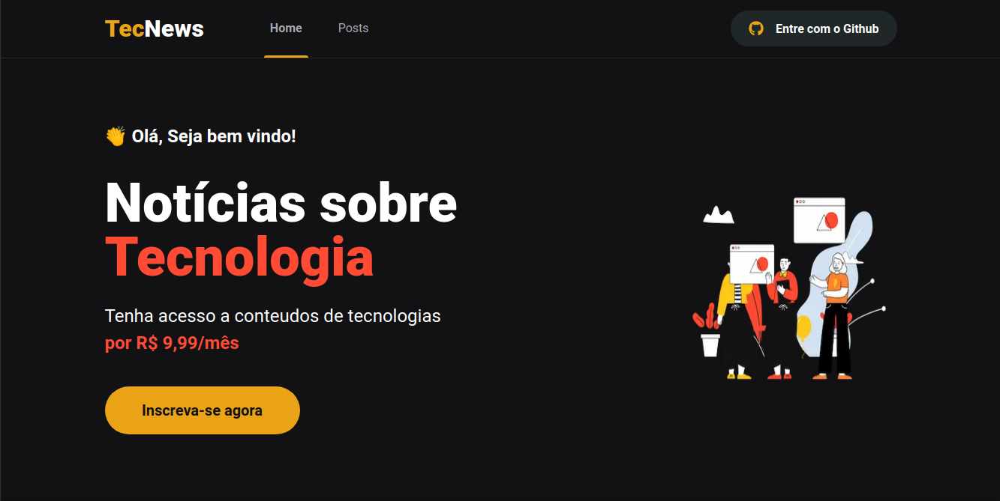
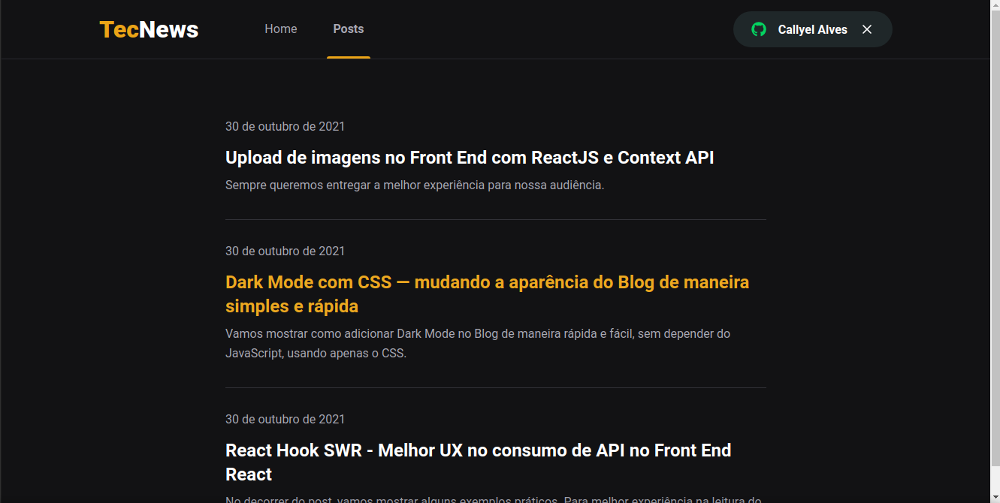
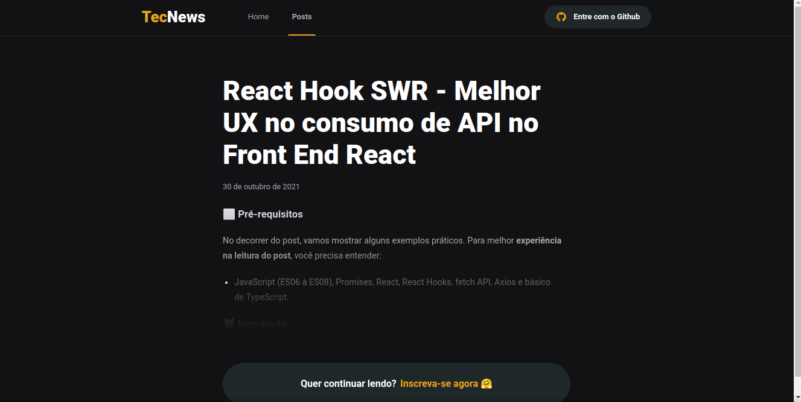

<h1 align="center">
  TECNEWS
</h1>

  <a href="#-tecnologias">Tecnologias</a>&nbsp;&nbsp;&nbsp;|&nbsp;&nbsp;&nbsp;
  <a href="#-projeto">Projeto</a>&nbsp;&nbsp;&nbsp;|&nbsp;&nbsp;&nbsp;
  <a href="#-layout">Layout</a>&nbsp;&nbsp;&nbsp;|&nbsp;&nbsp;&nbsp;
  <a href="#-como-executar">Como executar</a>&nbsp;&nbsp;&nbsp;|&nbsp;&nbsp;&nbsp;
  <a href="#-executando-a-aplicação">Executando a aplicação</a>

## ✨ Tecnologias

Esse projeto foi desenvolvido com as seguintes tecnologias:

- [React](https://reactjs.org)    
  
- [TypeScript](https://www.typescriptlang.org/)    

- [Next.js](https://nextjs.org/)      

- [Sass](https://sass-lang.com)    

## 💻 Projeto

O **tecnews** é um blog de notícias sobre tecnologias, nele você faz uma assinatura para poder ter acesso a todo o conteúdo, também é preciso fazer login com a sua conta do Github para ter acesso.

Essa aplicação tem conexões com as seguintes api's: 
* **Github** | Para autenticação do app.
* **Stripe** | É utilizado para realizar os pagamentos.
* **FaunaDB** | Armazena os registros dos usuários.
* **Prismic** | CMS responsável pela publicação dos posts.

## 🔖 Layout

  
    
  
    
  

## 🚀 Como executar

- Clone o repositório
- Instale as dependências com `yarn`
- Inicie o servidor com `yarn dev`

Agora você pode acessar [`localhost:3000`](http://localhost:3000) do seu navegador.

Lembrando que será preciso ter conta no stripe, faunadb, github e prismic para poder gerenciar o projeto.

## 🎬 Executando a aplicação

  

